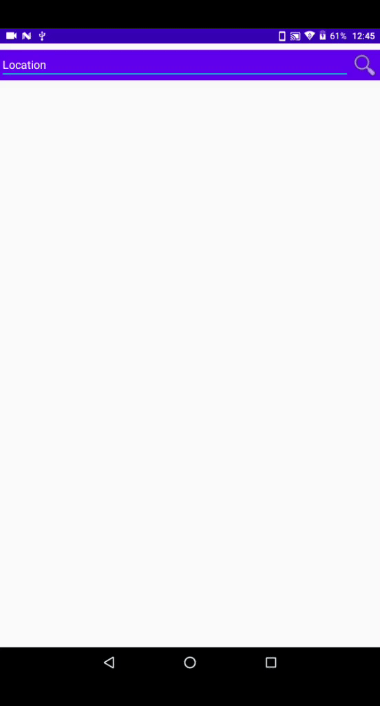

# MvvmWeather
This is simple weather application example to get temperature of the searched city and get the result from an api call from metaweather API's.the app is build using  retrofit2+room+mvvv+coroutines+liveData+viewmodel

